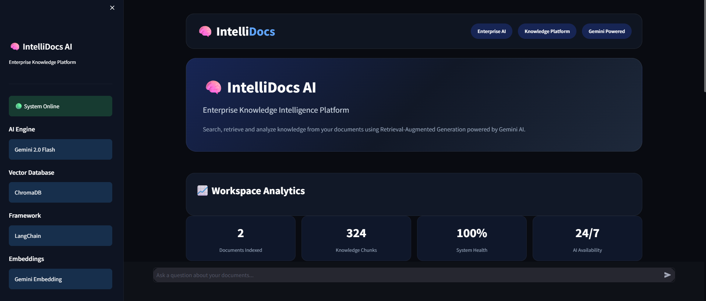
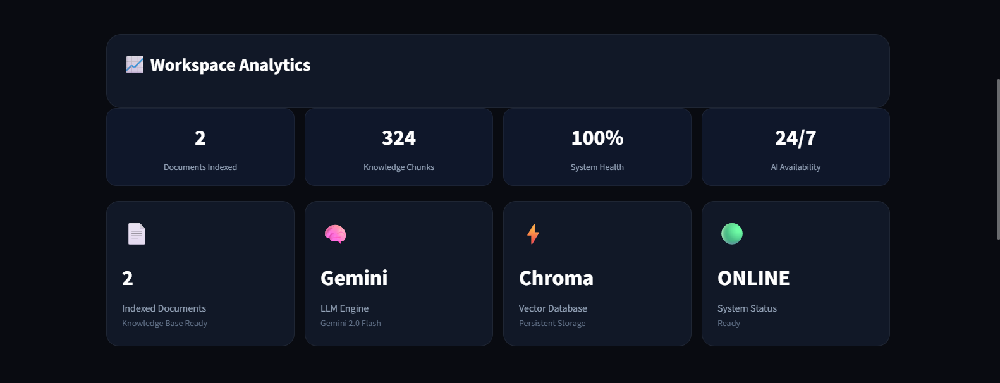
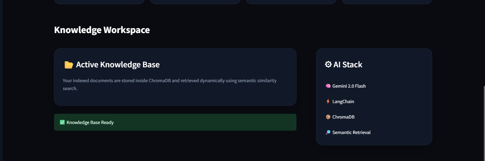
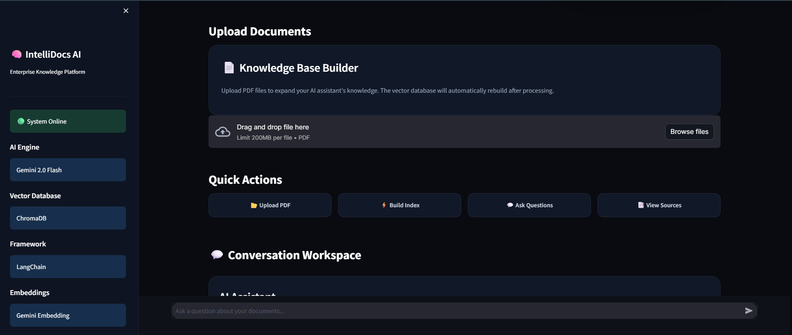
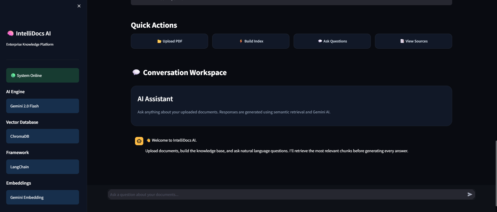
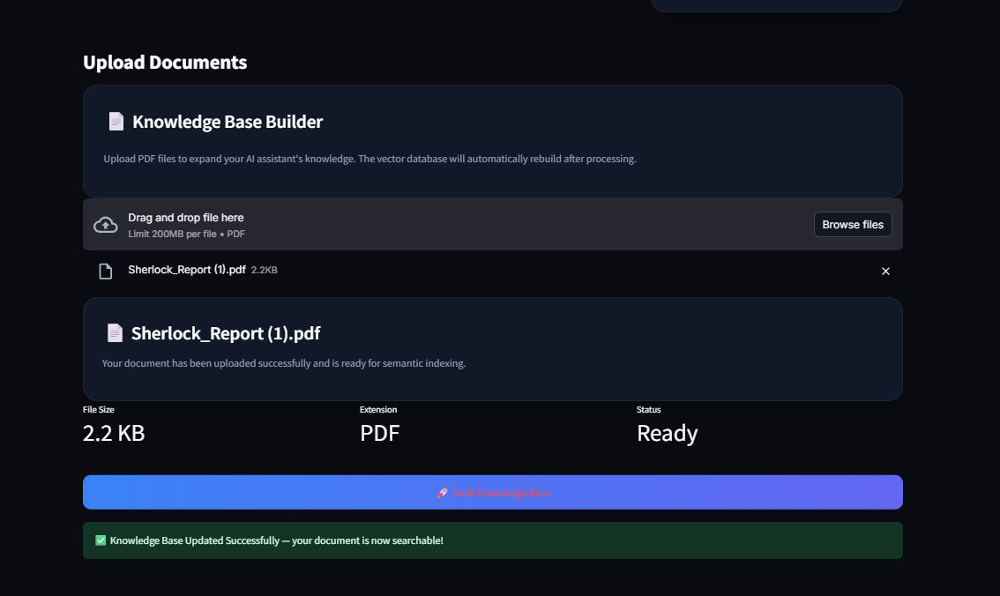
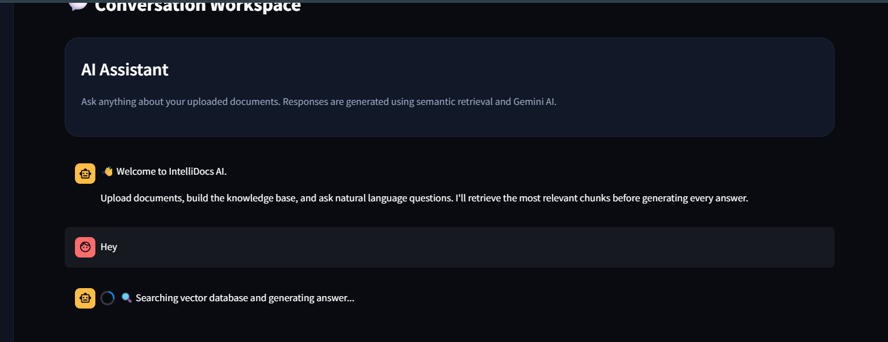

<div align="center">

# 🧠 IntelliDocs AI

### Enterprise Retrieval-Augmented Generation (RAG) Platform for Intelligent Document Search & Question Answering

Semantic Search • Retrieval-Augmented Generation • Google Gemini • ChromaDB

<p align="center">


</p>

---

### 🚀 AI-Powered Enterprise Knowledge Assistant

Upload PDF documents, build a semantic knowledge base, retrieve relevant information using vector search, and generate context-aware answers with Google Gemini.

</div>

---

## 📊 Project Highlights

| Metric | Value |
|---------|------:|
| Python Files | 2 |
| AI Model | Gemini 2.5 Flash |
| Embedding Model | Gemini Embedding |
| Vector Database | ChromaDB |
| Framework | LangChain |
| UI | Streamlit |
| Retrieval | Semantic Search |
| Architecture | Retrieval-Augmented Generation |


## ✨ Features

| Feature | Description |
|---------|-------------|
| 📄 PDF Upload | Upload enterprise documents |
| 🧠 Semantic Embeddings | Gemini Embedding Model |
| ⚡ Vector Search | Chroma similarity retrieval |
| 🤖 AI Chat | Gemini-powered responses |
| 📚 Source Retrieval | Displays retrieved chunks |
| 💾 Persistent Storage | Local Chroma Database |
| 🎨 Modern Dashboard | Enterprise-inspired UI |
| 🚀 Fast Response | Optimized retrieval pipeline |

---

# 🖥 Application Preview

## 🏠 Dashboard

<p align="center">

</p>

---

## 📂 Workspace Analytics

<p align="center">

</p>

---

## 📄 Knowledge Workspace

<p align="center">

</p>

---

## ⚡ Document Upload

<p align="center">

</p>

---

## 💬 AI Conversation

<p align="center">

</p>

---

## 📚 Knowledge Base Builder

<p align="center">

</p>

---

## 📊 Conversation Workspace

<p align="center">

</p>
```

---

# 🏗 System Architecture

```
                    +----------------------+
                    |   PDF Documents      |
                    +----------+-----------+
                               |
                               v
                    +----------------------+
                    | Document Loader      |
                    +----------+-----------+
                               |
                               v
                    +----------------------+
                    | Text Chunking        |
                    +----------+-----------+
                               |
                               v
                    +----------------------+
                    | Gemini Embeddings    |
                    +----------+-----------+
                               |
                               v
                    +----------------------+
                    | Chroma Vector DB     |
                    +----------+-----------+
                               |
                     Semantic Retrieval
                               |
                               v
                    +----------------------+
                    | Gemini 2.5 Flash LLM |
                    +----------+-----------+
                               |
                               v
                    +----------------------+
                    | Intelligent Answer   |
                    +----------------------+
```

---

# 📁 Project Structure

```text
IntelliDocs-AI
│
├── app.py
├── ingest.py
├── requirements.txt
├── .env
│
├── data/
│      sample.pdf
│
├── .chroma_db/
│
├── assets/
│      dashboard.png
│      upload.png
│      chat.png
│
└── README.md
```

---

# ⚙ Tech Stack

| Technology | Purpose |
|------------|----------|
| Python | Backend |
| Streamlit | Frontend |
| LangChain | RAG Pipeline |
| Google Gemini | Large Language Model |
| Gemini Embeddings | Text Embeddings |
| ChromaDB | Vector Database |
| PyPDF | PDF Processing |
| dotenv | Environment Variables |

---

# 🚀 Installation

Clone the repository

```bash
git clone https://github.com/YOUR_USERNAME/IntelliDocs-AI.git
```

Go inside the project

```bash
cd IntelliDocs-AI
```

Create virtual environment

```bash
python -m venv venv
```

Activate environment

Windows

```bash
venv\Scripts\activate
```

Install dependencies

```bash
pip install -r requirements.txt
```

---

# 🔑 Environment Variables

Create a `.env` file

```env
GEMINI_API_KEY=YOUR_API_KEY
```

---

# ▶ Run the Application

```bash
streamlit run app.py
```

---

# 📚 How It Works

1. Upload a PDF document

2. Document is split into semantic chunks

3. Gemini Embedding Model converts chunks into vectors

4. ChromaDB stores vector embeddings

5. User submits a query

6. Semantic Search retrieves the most relevant chunks

7. Gemini generates an answer using retrieved context

8. Source chunks are displayed for transparency

---

# 💡 Key Capabilities

- Enterprise document search
- AI-powered knowledge retrieval
- Semantic similarity search
- Retrieval-Augmented Generation (RAG)
- Interactive conversational assistant
- Persistent knowledge base
- Professional dashboard

---

# 📈 Future Improvements

- Multi-document support

- Chat history persistence

- Authentication

- User workspaces

- Multiple vector databases

- Cloud deployment

- Citation highlighting

- OCR support

- Drag & Drop upload

- Multiple LLM providers

---

# 📸 Screenshots

| Dashboard | Upload | Chat |
|------------|---------|------|
| Add Screenshot | Add Screenshot | Add Screenshot |

---

# 👨‍💻 Developed By

**Radha Rani**

Computer Science Undergraduate

AI • Machine Learning • Full Stack Development

---

## 📄 License

This project is released under the MIT License.

# ⭐ If you found this project useful

Please consider giving the repository a ⭐

It motivates further development.

---


<div align="center">

Made with ❤️ using

**Python • Streamlit • LangChain • Gemini AI • ChromaDB**

</div>


